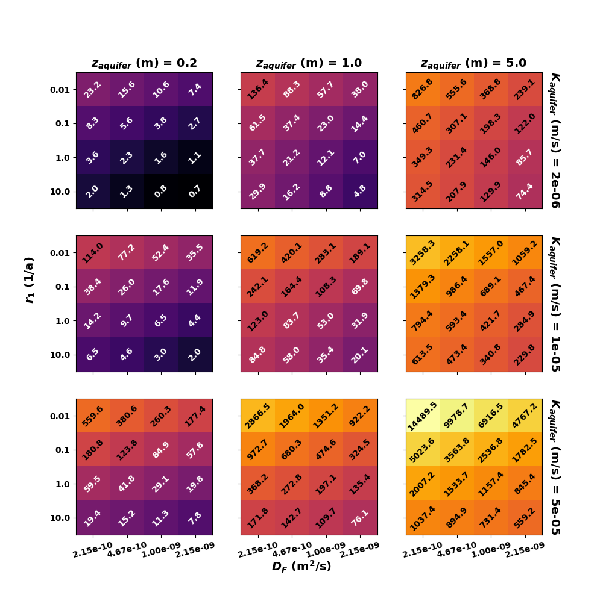
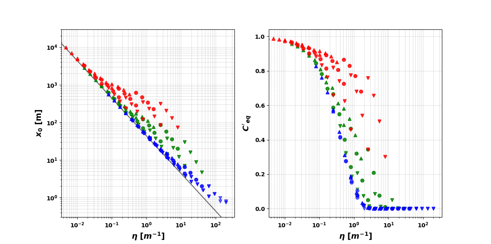

# ReactiveBackDiffusion2020

This repository contains _python_ scripts related to the following paper:

Halloran and Hunkeler (2020) "Controls on the persistence of aqueous-phase groundwater contaminants in the presence of reactive back-diffusion." _Science of the Total Environment_.

(A preprint version of the paper can be found in `journal_article/`.)

## Info
These scripts process and visualise data exported from numerical models. In the contaminant transport models 5 parameters are varied. The script calculates and visualises maximum normalised concentrations, time (or n pore volumes) for attenuation, and plume extent. Constructed parameters (η, Π1 and Π2) are also calculated and various quantities are plotted against them. All plots are exported to a time-stamped pdf file in the subfolder `out/`.

## Requirements 
You need a _python_ distribution (e.g., anaconda). The following standard _python_ packages are needed: pandas, matplotlib, numpy, datetime, scipy.

## User-defined variables
Three scenarios are tested. Each scenario has a different script. 
For Scenario A (aquifer between aquitards, contaminant source removed after fixed time) and Scenario B (aquitard between aquifers, contaminant source removed after fixed time), the following are defined by the user in the script: 
* `dropFactor`: The attenuation factor as a multiple of the maximum normalised concentration (i.e., <1) below which the normalised concentration must fall to determine n_v,att.
* `cutOffC`: A cut-off for normalised concentration below which results are ignored. Should be >1E-5 as this is the approximate precision of the numerical models.
* `pointNumber`: to select the observation well for analysis. 0 is the well at 20m, 1 is the well at 40 m, etc. For Scenario B, the wells beloew the aquitard layer are numbered 5-9, moving left-to-right. In the article it is `pointNumber=4` that is presented.

For Scenario C (aquifer between aquitards, constant contaminant source), only `cutOffC` and `pointNumber` need to be defined.

## Other use
Users are encouraged to use and modify these scripts however they wish (e.g., for visualisations of discrete data that is a function of 4 or 5 variables). I ask only that the above paper is cited in any published works.

## Example output
 
 